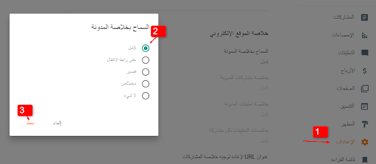
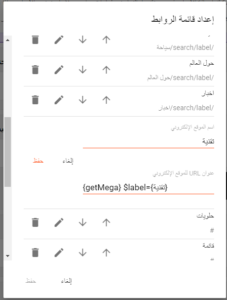
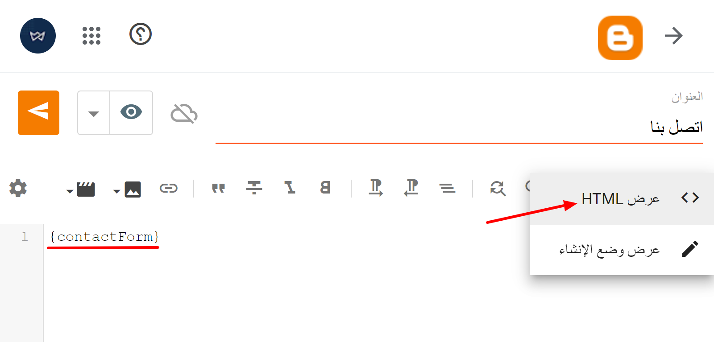
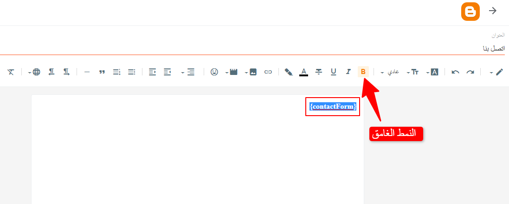

قالب برايث لا يحتوي الكثير من التعقيدات حيث يمكن تركيبه وضبط اعداداته بكل سهولة كما يتم توفير تحديثات مجانية وتقديم الدعم الفني المجاني للمشترين.

 **الميزات الرئيسية:**

 :fas fa-check fa-fw: تصميم متجاوب بالكامل

 :fas fa-check fa-fw: سرعة تحميل فائقة

 :fas fa-check fa-fw: محسن لمحركات البحث
(SEO)

 :fas fa-check fa-fw: دعم الوضع الليلي
    
# :fas fa-cog fa-fw: **تثبيت القالب**

اتبع هذه الخطوات بعناية لتثبيت القالب على مدونتك في بلوجر:
 
بعد تحميلك لملف القالب ستجده مضغوط بصيغة `.zip` قم بفك الضغط وادخل للمجلد ستلاحظ وجود ملف القالب بصيغة `.txt`

 
 :fas fa-dot-circle fa-fw: **من تبويب المظهر :**
 
**1-** نقوم بأخذ نسخة إحتياطية من القالب الحالي في المدونة بالضغط على زر **الاحتفاظ بنسخة احتياطية**

**2-** استخدم قالب من قوالب بلوجر الإفتراضية لتنظيف اكواد القالب القديم او استخدم قالب تنظيف.  [ رابط التحميل](https://drive.google.com/uc?export=download&id=1vUKdDDoj7mHXzyM--BEjOdm8mmz2T14z)

**3-** نقوم بنسخ محتوى ملف القالب الذي تم تحميله.

**4-** نقوم بتحرير أكواد المدونة عن طريق الضغط على زر :  **تعديل HTML**

**أخيرًا -** نقوم بحذف جميع الأكواد الموجودة ولصق محتوى ملف القالب الذي قمنا بنسخه والضغط على زر **حفظ**  بعد الإنتهاء:

 ##  :fas fa-caret-left fa-fw: **السماح بخلاصة المدونة**
- افتح لوحة تحكم بلوجر الخاصة بك
- انتقل **للاعدادت**
- السماح بخلاصة المدونة
- ثم تختار **كامل** ثم **حفظ**

 ## :fas fa-chevron-left fa-fw: أكواد الميتا
?> ملاحظة
أغلب أكواد الميتا في قالب برايت جاهزه وتعمل بشكل تلقائي حسب القيم التي يمكن استخلاصها من كل صفحة ، لكن بعض أكواد الميتا لابد من إضافتها بشكل يدوي داخل القالب .

الخطوات:
- نقوم بفتح تبويب المظهر
-ثم إختيار **تعديل HTML**
-نقوم بفتح تبويب **المظهر**  
-سنجد في بداية الأكواد التعليق  `<!-- Required -->`
-بعد العنوان ستقوم بملئ البيانات والضغط على زر **الحفظ** بعد الانتهاء

 التعديلات المطلوبة:
-معرف ID تطبيق الفيس بوك
-معرف ID صفحة موقعك على تويتر.
-معرف ID حساب ادمن موقعك على تويتر.

 ## :fas fa-chevron-left fa-fw: الصورة البديلة

?> ملاحظة
الصور البديلة هي التي تظهر تلقائيا في حاله عدم وجود صورة بالمقالات او عند نشر رابط الصفحة الرئيسية على مواقع التواصل الإجتماعي وكذلك الصورة البديلة الخاصه بالمستخدم الذي تظهر على المدونة.

الخطوات

# الهيدر
## الشعار

هناك خيارين لعنصر الشعار في القالب :
- إظهار أسم الموقع ووصفه .
- رفع صورة للشعار لتظهر بدلاً من الأسم والوصف .

الأبعاد المناسبة للشعار:

العرض الأصلي: `1525px`

الارتفاع الاصلي: `450px`

##  :fas fa-bars fa-fw:  القائمة الرئيسية 

ملاحظة
توفر أكثر من شكل لعرض الروابط والأقسام، مما يتيح لك إنشاء تجربة تصفح متقدمة ومنظمة لزوار موقعك.

## أشكال عرض القائمة
استخدم لجلب رابط الصفحة الرئيسية : `{homepage}`

 ## :fas fa-chevron-left fa-fw: الروابط العادية

اسم الموقع: `رياضة`

رابط الموقع: `https://example.com/search/label/sports`

 ## :fas fa-chevron-left fa-fw: القائمة المنسدلة الفردية
`_`  قبل اسم الرابط الفرعي.

مثال:
الرابط الأب: `منسدلة`
الروابط الفرعية:
`_منسدل 1`
`_منسدل 2`
`_منسدل 3`

 ## :fas fa-chevron-left fa-fw: عرض المشاركات (ميجا مينو)
_ قائمة الميجا مينيو تتيح لك عرض التدوينات بشكل جذاب داخل القائمة. 

- في خانة أسم الموقع الجديد يتم إضافة اسم التصنيف.
- في خانة عنوان URL للموقع الجديد يتم إضافة هذا الكود: `{getMega} $label={تصنيف}`
على سبيل المثال: `{getMega} $label={اخبار}`
او استخدام `recent` لعرض اخر التتدوينات

 ## :fas fa-chevron-left fa-fw: مواقع التواصل الإجتماعي
يوجد في القالب موقعين لعرض أيقونات مواقع التواصل الإجتماعي الأول في الشريط العلوي والثاني في الفوتر
يمكنك إضافة روابط مواقع التواصل الاجتماعي الخاصة بك باتباع الخطوات التالية:
-افتح لوحة تحكم بلوجر
-اذهب الى قسم التنسيق
-ابحث عن اداة باسم `مواقع التواصل الإجتماعي`
-قم بعمل تحرير بالضغط على زر `القلم`
-قم بالضغط على إضافة عنصر جديد
-في خانة `أسم الموقع الالكتروني` قم بوضع اسم الموقع بحروف صغيرة
-في خانة `عنوان URL للموقع الالكتروني` قم باضافة رابط الموقع
-بعد إضافة كل موقع لابد من الضغط على زر `إضافة إرتباط`
-وبعد الإنتهاء من إضافة جميع الروابط نقوم بالضغط على `حفظ`

 ## :fas fa-chevron-left fa-fw: مواقع التواصل الإجتماعي

 يوجد في القالب موقعين لعرض أيقونات مواقع التواصل الإجتماعي الأول في الشريط العلوي والثاني في الفوتر

قم بادخال اسم موقع التواصل في الحقل  **اسم الموقع الجديد**

مواقع التواصل التي يدعمها القالب

`blogger`, `apple`, `amazon`, `microsoft`, `facebook`, `facebook-f`, `twitter`, `rss`, `youtube`, `skype`, `stumbleupon`, `tumblr`, `vk`, `stack-overflow`, `github`, `linkedin`, `dribbble`, `soundcloud`, `behance`, `digg`, `instagram`, `pinterest`, `pinterest-p`, `twitch`, `steam`, `delicious`, `codepen`, `flipboard`, `reddit`, `whatsapp`, `telegram`, `messenger`, `snapchat`, `email`, `discord`, `quora`, `share`, `external-link`

ثم اضف الرابط في حقل ‏**عنوان URL للموقع الجديد** اضغط **اضف** رابط يمكن استخدام الأسهم على اليسار للترتيب ثم اضغط **حفظ**

# اضافة المواضيع في الشريط الجانبي والفوتر
هناك شكلين للمواضيع يمكن عرضها في الشريط الجانبي والفوتر فقط، باستعمال الكود التالي :

مثال:

لعرض تصنيف معين :  `label`

لعرض اخر المواضيع  : `recent`

لعرض التعليقات :     `comments`

نقوم بإضافة أداة جديدة داخل تبويب من نوع HTML/JavaScript في الشريط الجانبي أو الفوتر ويتم إضافة الكود السابق بداخلها والضغط على زر حفظ.
مثال:

# أكواد قصيرة
بعض الأكواد القصيرة يمكن استخدامها داخل التدوينات او لعمل صفحات ثابته مثل صفحة نموذج الاتصال . ويتم إضافة الكود داخل تبويب HTML  أثناء كتابة المشاركة.

|  |  |
|---|---|
| نموذج الاتصال | `{contactForm}` |
| الأكواد البرمجية | `{codeBox}` |
| عرض الموضوع بشكل كامل | `{fullWidth}` |

 مثال:

أضف الرمز القصير في المكان الذي تريده في الصفحة

 ثم حدد الرمز القصير وأضف **النمط الغامق**.

# تخصيص القالب

> :fas fa-star fa-fw: اعدادات القالب تنقسم الي قسمين القسم الأول هو التحكم في القالب عن طريق التنسيق لاضافة العناصر وحذفها في جميع انحاء القالب اما القسم الثاني هو التحكم من التخصيص وهو التحكم في ايقاف او تشغيل الخصائص وتغيير الخط وتغيير الألوان وتغير شكل القائمة العلوية الخ .. وفي هذا الشرح سنقوم بعرض جميع الخصائص التي يمكنك استخدامها من التخصيص مع شرح كيفية استخدامها

اولا كيفية الدخول الي تخصيص القالب 
اذهب الي تبويب 
اضغط علي زر

من لوحة التحكم > المظهر > الضغط على زر **تخصيص**
1- تغيير اللون الرئيسي

هذة صورة متحركة توضيحية للعمليه السابقة

